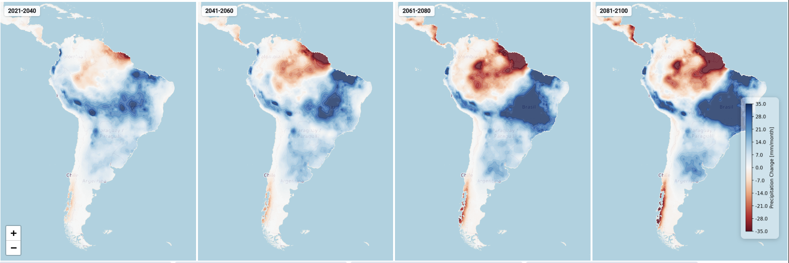

# climatemaps

An interactive web application for visualizing global historical climate data and future climate projections. It show temperature, precipitation, and other climate variables with support for multiple climate scenarios (SSP1-2.6, SSP2-4.5, SSP3-7.0, SSP5-8.5) and time periods (2020-2100).



## Demo

**[openclimatemap.org](https://openclimatemap.org)**

## Data

### Historic

- CRU TS (Climatic Research Unit Time-Series): https://catalogue.ceda.ac.uk/uuid/ec331e93d21347e6bf5fa4b9c68dbd2c/
- Historic 1970-2000 WorldClim data: https://www.worldclim.org/data/worldclim21.html

### Projections (predictions)

- WorldClim: Downscaled CMIP5 and CMIP6 model outputs for 2021–2100: https://www.worldclim.org/data/cmip6/cmip6_clim5m.html

### Other (not used)

- https://interactive-atlas.ipcc.ch/
- ERA5 monthly averaged data on single levels from 1940 to present: https://cds.climate.copernicus.eu/datasets/reanalysis-era5-single-levels-monthly-means?tab=overview
- ERA5 post-processed daily statistics on single levels from 1940 to present: https://cds.climate.copernicus.eu/datasets/derived-era5-single-levels-daily-statistics?tab=overview
- Copernicus Climate Data Store - CMIP6 climate projections:
  https://cds.climate.copernicus.eu/datasets/projections-cmip6?tab=overview
- NASA NEX-GDDP-CMIP6 (~25 km resolution): https://registry.opendata.aws/nex-gddp-cmip6/
- CHELSA (~1km resolution): https://chelsa-climate.org/

## Development

### Dependencies

##### GDAL

GDAL is needed for the gdal2tiles.py script that creates map-tiles from a single image (matplotlib plot).

Install GDAL with conda to prevent the need to install a hugh number of system level dependencies:

```bash
conda install -c conda-forge gdal==3.11.0
```

##### Tippecanoe

**WARNING**: tippecanoe 1.19.1 is the latest version that produces valid GeoJSON due to issue https://github.com/mapbox/tippecanoe/issues/652

TODO: migrate to active fork https://github.com/felt/tippecanoe

```bash
sudo apt install libsqlite3-dev
git clone https://github.com/mapbox/tippecanoe.git
cd tippecanoe
git checkout tags/1.19.1
make -j
make install
```

#### tileserver-gl

```bash
npm install -g tileserver-gl
```

### Run

#### Create contour data

Run:

```bash
python scrips/create_contour.py
```

to create contour and raster mbtiles.

#### Create tileserver config

```bash
python scripts/create_tileserver_config.py
```

to generate the tileserver config.

#### Run the backend (FastAPI server)

```bash
uvicorn api.main:app --reload
```

#### Run the tileserver (tileserver-gl)

```bash
tileserver-gl --config tileserver_config_dev.json --port 8080
```

#### Run the client (Angular)

In `./client` run:

```bash
ng serve
```

Or run against the openclimatemap.org API and tileserver:

```
ng serve --configuration=production-backend
```

### Tests

Run:

```bash
pytest
```

## Build and deploy (to openclimatemap.org)

### Everything

Build and deploy client and backend:

```bash
bash scripts/deploy.sh
```

TODO: include create tiles, create config and upload tiles

### Client

Deploy the client angular app:

```bash
bash scripts/deploy_client.sh
```

### API and TileServer

```bash
bash scripts/deploy_backend.sh
```

### Upload tiles (optional)

If you have locally created tiles, upload them to the server with:

```bash
rsync -avP data/tiles openclimatemap.org:/home/bart/climatemaps/data/
```

### TODO

- Add explanation of climate scenarios
